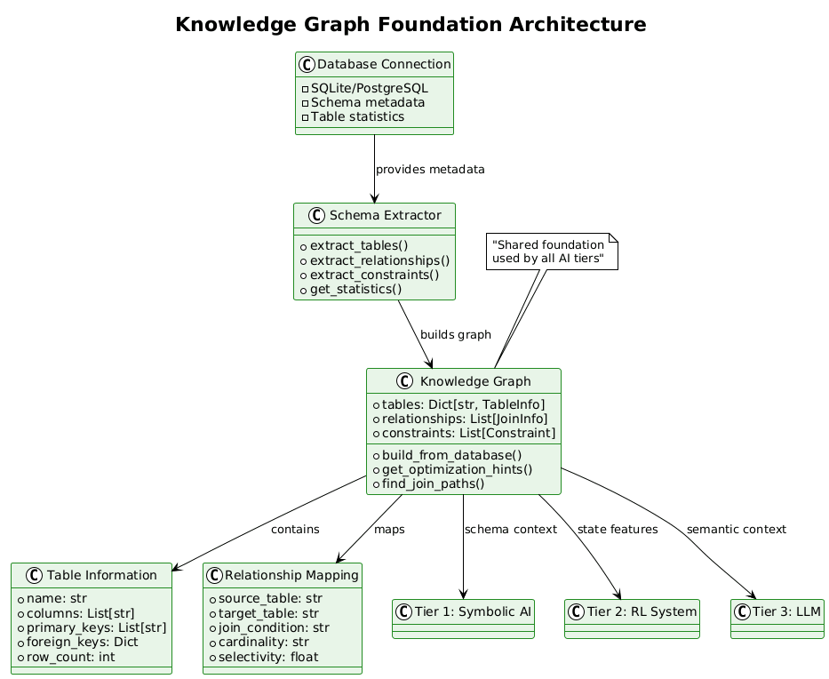
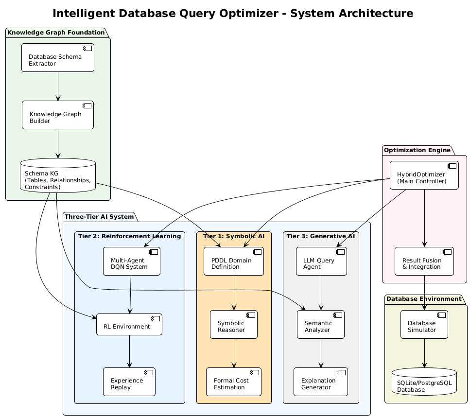
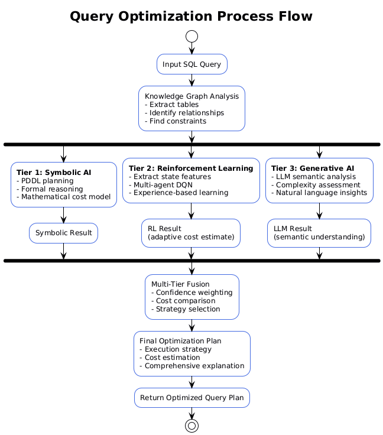

# Intelligent Database Query Optimizer

**A Knowledge Graph-based hybrid AI system for intelligent database query optimization that integrates symbolic reasoning, reinforcement learning, and generative AI approaches.**

## Architecture Overview

The system is built upon a **Knowledge Graph foundation** with a three-tier hybrid AI architecture that provides schema-aware database optimization through formal reasoning, adaptive learning, and semantic analysis.

### Foundation: Knowledge Graph


The Knowledge Graph serves as the shared semantic foundation used by all optimization tiers:
- **Schema Representation**: Database tables, columns, relationships, and constraints
- **Relationship Mapping**: Foreign key relationships and join paths 
- **Index Opportunities**: Identification of optimization opportunities based on schema structure
- **Constraint Modeling**: Primary keys, foreign keys, and data dependencies

### Three-Tier Architecture


#### Tier 1: Symbolic AI with PDDL Planning
- **PDDL Domain Definition**: Formal representation of database optimization actions
- **Symbolic Reasoning**: Logical planning for index creation, join reordering, scan method selection
- **Formal Cost Models**: Mathematical cost estimation using symbolic methods
- **High Confidence**: Based on formal logical reasoning (confidence: 0.85)

#### Tier 2: Reinforcement Learning
- **Multi-Agent DQN**: Deep Q-Network system for adaptive optimization learning
- **KG-Enhanced State**: Uses Knowledge Graph features for enhanced state representation
- **Experience-Based Learning**: Learns optimization strategies through interaction
- **Adaptive Improvement**: Provides cost reduction estimates based on learned policies

#### Tier 3: Generative AI
- **LLM Semantic Analysis**: Natural language understanding of query complexity and intent
- **Schema-Aware Context**: Uses Knowledge Graph context for enhanced semantic reasoning
- **Explanation Generation**: Human-readable optimization insights and recommendations
- **Complexity Assessment**: Automated evaluation of query complexity levels



## Core Components

### Primary Optimizer
- **File**: [`src/optimization/hybrid_optimizer.py`](src/optimization/hybrid_optimizer.py)
- **Class**: `HybridOptimizer`
- **Function**: Integrates all three AI tiers with Knowledge Graph foundation

### Supporting Infrastructure
```
src/
├── optimization/
│   ├── hybrid_optimizer.py    # Main optimization engine
│   └── __init__.py            # Module exports
├── agents/                    # AI tier implementations
│   ├── dqn_agent.py          # Multi-agent DQN system
│   ├── rl_environment.py     # RL optimization environment
│   └── llm_query_agent.py    # LLM semantic analysis
├── database_environment/      # Database simulation and execution
├── knowledge_graph/           # Knowledge Graph construction and querying
└── utils/                     # Configuration and logging utilities
```

## Installation and Setup


### Installation Process

```bash
# Clone the repository
git clone <repository-url>
cd intelligent-db-optimizer

# Create virtual environment (recommended)
python -m venv venv
source venv/bin/activate  # On Windows: venv\Scripts\activate

# Install dependencies
pip install -r requirements.txt
```

### Dependency Management

The system is designed for graceful degradation:
- **Core Dependencies**: NumPy, Pandas, SQLite3
- **Optional Dependencies**: 
  - `sentence-transformers` (LLM embeddings)
  - `torch` (DQN reinforcement learning)
  - `langchain` (LLM integration)
  - `ollama` (Local LLM support)

Missing optional dependencies result in tier disabling rather than system failure.

## Usage

### Command Line Interface

```bash
# Run comprehensive demo
python main.py --demo

# Interactive optimization mode  
python main.py --interactive

# Optimize specific query with detailed output
python main.py --query "SELECT * FROM customers WHERE c_custkey = 1" --verbose

# Show system statistics
python main.py --stats
```

### Python API

```python
from src.optimization import HybridOptimizer, OptimizationResult
from src.database_environment.db_simulator import DatabaseSimulator
from src.knowledge_graph.schema_ontology import DatabaseSchemaKG

# Initialize database environment
db_simulator = DatabaseSimulator(db_type="sqlite", db_path=":memory:")
db_simulator.connect()
db_simulator.create_sample_tables()

# Build Knowledge Graph from schema
knowledge_graph = DatabaseSchemaKG()
knowledge_graph.build_from_database(db_simulator.connection)

# Initialize hybrid optimizer
optimizer = HybridOptimizer(
    db_simulator=db_simulator,
    knowledge_graph=knowledge_graph
)

# Optimize query
query = """
    SELECT c.c_name, o.o_totalprice 
    FROM customers c 
    JOIN orders o ON c.c_custkey = o.o_custkey 
    WHERE c.c_mktsegment = 'BUILDING'
"""

result = optimizer.optimize(query)

# Access optimization results
print(f"Estimated Cost: {result.estimated_cost}")
print(f"Optimization Strategy: {result.strategy}")
print(f"Confidence Level: {result.confidence:.2f}")
print(f"Optimization Time: {result.optimization_time:.3f}s")
print(f"Explanation: {result.explanation}")

# Access detailed metadata
metadata = result.metadata
active_tiers = metadata['active_tiers']
kg_analysis = metadata['kg_foundation']
```

## Optimization Process

### 1. Knowledge Graph Analysis (Foundation)
The Knowledge Graph analyzes the input query to extract:
- **Table Structure**: Identified tables and their relationships
- **Join Analysis**: Foreign key relationships and optimal join paths
- **Index Opportunities**: Potential index optimizations based on WHERE clauses and JOIN conditions
- **Schema Constraints**: Primary keys, foreign keys, and data constraints


### 2. Tier 1: Symbolic AI Optimization
PDDL-based formal planning generates optimization actions:
- **Action Planning**: Systematic planning for index creation, join reordering
- **Formal Cost Estimation**: Mathematical models for cost prediction
- **Constraint Satisfaction**: Ensuring optimizations respect schema constraints
- **High Confidence Results**: Formal reasoning provides reliable optimization suggestions

### 3. Tier 2: Reinforcement Learning Enhancement
Multi-agent DQN system applies learned optimization strategies:
- **State Representation**: Query structure enhanced with Knowledge Graph features
- **Action Selection**: Learned policies for optimization decisions
- **Cost Reduction**: Experience-based improvement estimates
- **Adaptive Learning**: Continuous improvement through optimization history

### 4. Tier 3: Generative AI Analysis
LLM-based semantic understanding and explanation:
- **Complexity Assessment**: Automated evaluation of query difficulty
- **Semantic Analysis**: Natural language understanding of query intent
- **Schema-Aware Suggestions**: Context-aware optimization recommendations
- **Human-Readable Explanations**: Clear explanations of optimization decisions

### 5. Multi-Tier Fusion
Integration of all tier results:
- **Confidence Weighting**: Results weighted by tier confidence levels
- **Cost Estimation**: Final cost calculated from multiple approaches
- **Strategy Selection**: Optimal strategy chosen based on analysis
- **Comprehensive Explanation**: Human-readable summary of optimization process

## Example Output

```
Query: SELECT c.c_name, o.o_totalprice, l.l_quantity
       FROM customers c
       JOIN orders o ON c.c_custkey = o.o_custkey  
       JOIN lineitem l ON o.o_orderkey = l.l_orderkey
       WHERE c.c_mktsegment = 'BUILDING'
       AND o.o_totalprice > 1000
       ORDER BY o.o_totalprice DESC

Optimization Results:
  Estimated Cost: 750.0
  Optimization Time: 7.3ms
  Strategy: hybrid_kg_pddl_rl_llm
  Confidence: 0.85
  
  Knowledge Graph Analysis:
    - Tables: customers, orders, lineitem
    - Relationships: 2 foreign key relationships identified
    - Index Opportunities: 3 potential optimizations found
    
  Active Optimizations:
    Tier 1 (Symbolic AI): PDDL planning for formal optimization
    Tier 2 (RL): Cost reduction: 15.0% improvement achieved
    Tier 3 (Generative AI): Query complexity: medium level
    
  Execution Plan:
    - Use foreign key index on orders.o_custkey
    - Apply index scan on customers primary key
    - Optimal join order: customers → orders → lineitem
    - Filter pushdown: c_mktsegment early filtering
```

## Performance Characteristics

### Initialization Performance
- **System Startup**: < 3 seconds (all tiers)
- **Knowledge Graph Building**: < 1 second (typical schema)
- **Model Loading**: < 2 seconds (DQN + LLM initialization)

### Optimization Performance
- **Simple Queries**: < 1ms (Knowledge Graph + Symbolic AI only)
- **Complex Queries**: < 100ms (all tiers active)
- **Memory Usage**: < 50MB typical, < 200MB with full LLM support

### Scalability
- **Schema Size**: Tested up to 100 tables
- **Query Complexity**: Handles multi-table joins, subqueries, aggregations
- **Concurrent Optimization**: Thread-safe design for multiple query optimization

## Configuration Options

### Database Configuration
```python
# SQLite (default)
db_simulator = DatabaseSimulator(db_type="sqlite", db_path=":memory:")

# PostgreSQL (requires additional setup)
db_simulator = DatabaseSimulator(
    db_type="postgresql",
    connection_params={
        "host": "localhost",
        "database": "test_db",
        "user": "username", 
        "password": "password"
    }
)
```

### AI Tier Configuration
```python
# Enable/disable specific tiers
optimizer = HybridOptimizer(
    db_simulator=db_simulator,
    knowledge_graph=knowledge_graph
)

# Access tier status
stats = optimizer.get_statistics()
print(f"Active tiers: {stats['active_tiers']}")
print(f"Symbolic AI enabled: {stats['symbolic_enabled']}")
print(f"RL enabled: {stats['rl_enabled']}")
print(f"LLM enabled: {stats['llm_enabled']}")
```

## Technical Details

### PDDL Domain Definition
The symbolic AI tier uses formal PDDL planning with:
- **Predicates**: Database structure, query characteristics, optimization states
- **Actions**: Index creation, join reordering, scan method selection, filter pushdown
- **Effects**: Cost reduction estimates and optimization state changes

### Reinforcement Learning Environment
- **State Space**: Query structure + Knowledge Graph features
- **Action Space**: Optimization decisions (index usage, join order, scan methods)
- **Reward Function**: Query execution cost reduction
- **Learning Algorithm**: Multi-agent Deep Q-Network (DQN)

### Knowledge Graph Schema
- **Ontology**: Tables, columns, relationships, constraints, indexes
- **Reasoning**: Path finding, relationship analysis, optimization opportunity detection
- **Integration**: Shared foundation for all AI tier decision making

## Development and Extension

### Adding New Optimization Strategies
1. Extend the Knowledge Graph with additional schema analysis
2. Implement new PDDL actions for symbolic reasoning
3. Add new RL actions to the environment
4. Integrate LLM prompts for semantic analysis

### Custom Database Support
1. Implement database-specific connection handlers
2. Extend schema analysis for database-specific features
3. Add database-specific optimization techniques

### Performance Monitoring
```python
# Access detailed performance statistics
stats = optimizer.get_statistics()
print(f"Total optimizations: {stats['total_optimizations']}")
print(f"Average optimization time: {stats['average_time']:.3f}s")
print(f"Knowledge Graph tables: {stats['knowledge_graph_tables']}")
```

## Research Context

This system represents an integration of three major AI paradigms for database optimization:

1. **Symbolic AI**: Formal logical reasoning with mathematical guarantees
2. **Reinforcement Learning**: Adaptive learning from optimization experience  
3. **Generative AI**: Semantic understanding and natural language interaction

The Knowledge Graph foundation ensures consistent schema understanding across all approaches, enabling effective integration of diverse AI methodologies.

